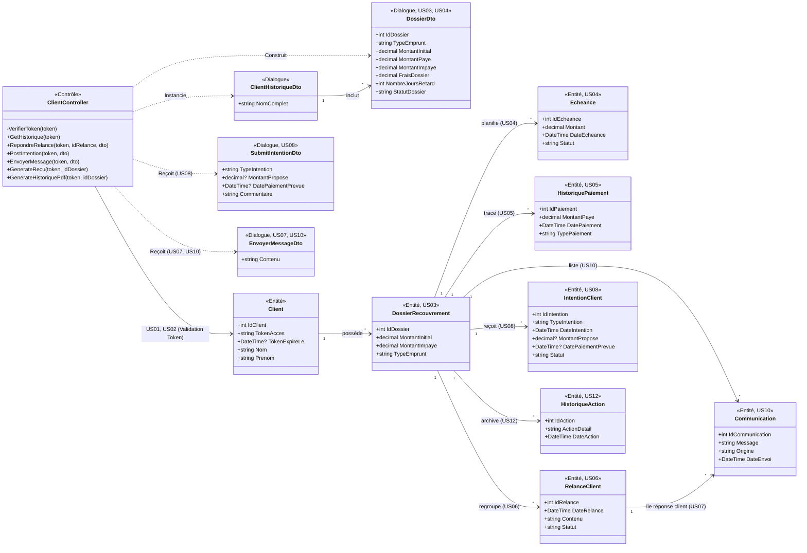

# Diagramme de Classes - Espace Client
*(Mis à jour pour correspondre parfaitement aux données des User Stories US01 à US13 et au code backend)*

Ce diagramme lie précisément chaque entité, DTO et méthode de contrôle aux exigences définies dans le tableau des User Stories.

